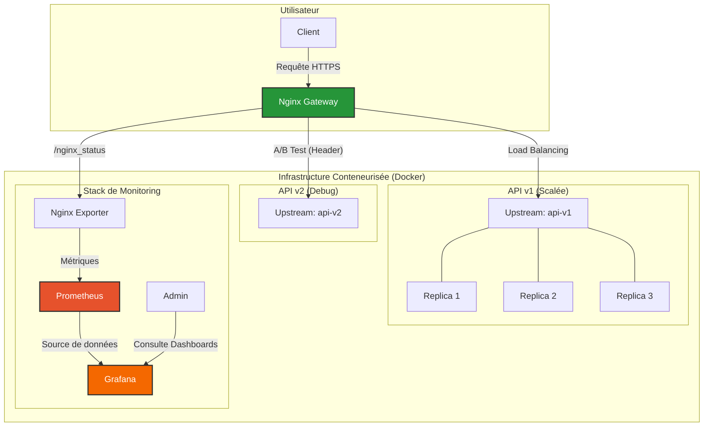

# MLOps – API Gateway Nginx pour un modèle de détection de sentiment

API de prédiction de sentiment (modèle scikit-learn pré-entraîné, 13 émotions) servie
via FastAPI et exposée derrière Nginx jouant le rôle d'API Gateway.
Le projet met en œuvre une architecture conteneurisée de production : reverse proxy,
load balancing, HTTPS, authentification, rate limiting, A/B testing et monitoring.

## Architecture



Nginx est le seul point d'entrée exposé vers l'extérieur (ports 80 et 443). Les
services d'API ne sont accessibles que sur le réseau Docker interne, jamais directement.

| Brique | Rôle |
|---|---|
| **Nginx** | Gateway : terminaison HTTPS, redirection HTTP→HTTPS, auth, rate limiting, routage |
| **api-v1** (×3) | Version standard de l'API, répartie en 3 répliques (load balancing) |
| **api-v2** | Version « debug » : renvoie en plus les probabilités par classe |
| **nginx_exporter** | Convertit `/nginx_status` en métriques Prometheus |
| **Prometheus** | Collecte les métriques de l'exporter |
| **Grafana** | Visualise les métriques |

## Fonctionnalités

1. **Reverse Proxy** — Nginx route tout le trafic vers les API en interne.
2. **Load Balancing** — `api-v1` tourne en 3 répliques, équilibrées en round-robin via le DNS Docker.
3. **HTTPS** — certificats auto-signés ; tout le trafic HTTP (port 80) est redirigé vers HTTPS (port 443).
4. **Contrôle d'accès** — l'endpoint `/predict` est protégé par authentification basique.
5. **Rate Limiting** — `/predict` est limité à 10 requêtes/seconde par IP (burst de 20).
6. **A/B Testing** — le trafic part vers `api-v2` uniquement si l'en-tête `X-Experiment-Group: debug` est présent, sinon vers `api-v1`.
7. **Monitoring** — stack Prometheus + Grafana alimentée par l'exporter Nginx.

## Prérequis

- Docker
- Docker Compose
- `make`

## Lancement

```bash
make start-project   # build et démarre tous les services en arrière-plan
make test            # exécute la suite de tests (tests/run_tests.sh)
make stop-project    # arrête et supprime les conteneurs
```

Après `make start-project`, vérifier que tous les conteneurs tournent :

```bash
docker ps
# 3× api-v1, 1× api-v2, nginx, nginx_exporter, prometheus_server, grafana_dashboard
```

## Utilisation de l'API

L'endpoint `/predict` attend un corps JSON `{"sentence": "..."}` et requiert une
authentification basique (`admin` / `admin`). Le certificat étant auto-signé, on fournit
le `.crt` à curl via `--cacert` (ou `-k` pour ignorer la vérification).

**Prédiction standard (api-v1) :**

```bash
curl -X POST "https://localhost/predict" \
  -H "Content-Type: application/json" \
  -d '{"sentence": "Oh yeah, that was soooo cool!"}' \
  --user admin:admin \
  --cacert ./deployments/nginx/certs/nginx.crt
```

Réponse :

```json
{"prediction value": "happiness"}
```

**Prédiction debug (api-v2)** via l'en-tête A/B :

```bash
curl -X POST "https://localhost/predict" \
  -H "Content-Type: application/json" \
  -H "X-Experiment-Group: debug" \
  -d '{"sentence": "Oh yeah, that was soooo cool!"}' \
  --user admin:admin \
  --cacert ./deployments/nginx/certs/nginx.crt
```

Réponse : la prédiction + le dictionnaire des probabilités par classe
(`prediction_proba_dict`).

## Interfaces de monitoring

| Service | URL | Identifiants |
|---|---|---|
| Grafana | http://ip:3000 | `admin` / `admin` |
| Prometheus | http://ip:9090 | — |

Dans Grafana, ajouter Prometheus comme source de données
(`http://prometheus_server:9090`), puis importer un dashboard Nginx
(ex. ID `12708`) pour visualiser les métriques.

> **Accès distant :** si le projet tourne sur une machine distante (ex. instance AWS),
> remplacer `localhost` par l'adresse IP de la machine et veiller à ouvrir les ports
> concernés (443, 3000, 9090) dans le pare-feu / security group.

## Structure du projet

```sh
.
├── Makefile                      # start-project / stop-project / test
├── README.md                     # ce fichier
├── README_student.md             # énoncé de l'examen
├── docker-compose.yml            # orchestration de tous les services
├── deployments
│   ├── nginx
│   │   ├── Dockerfile
│   │   ├── nginx.conf            # reverse proxy, HTTPS, auth, rate limit, A/B
│   │   ├── .htpasswd             # authentification basique (admin:admin)
│   │   └── certs                 # certificats auto-signés (nginx.crt / nginx.key)
│   └── prometheus
│       └── prometheus.yml        # configuration du scrape de l'exporter
├── model
│   └── model.joblib              # modèle pré-entraîné
├── src
│   └── api
│       ├── requirements.txt
│       ├── v1                    # API standard (Dockerfile + main.py)
│       └── v2                    # API debug   (Dockerfile + main.py)
└── tests
    └── run_tests.sh              # tests automatisés des fonctionnalités clés
```